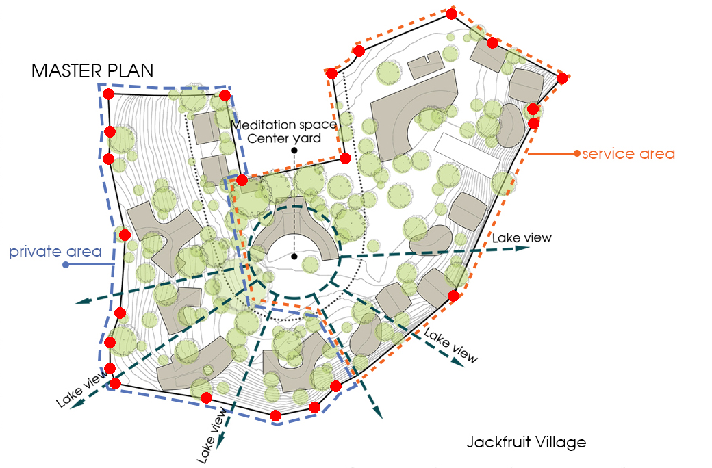
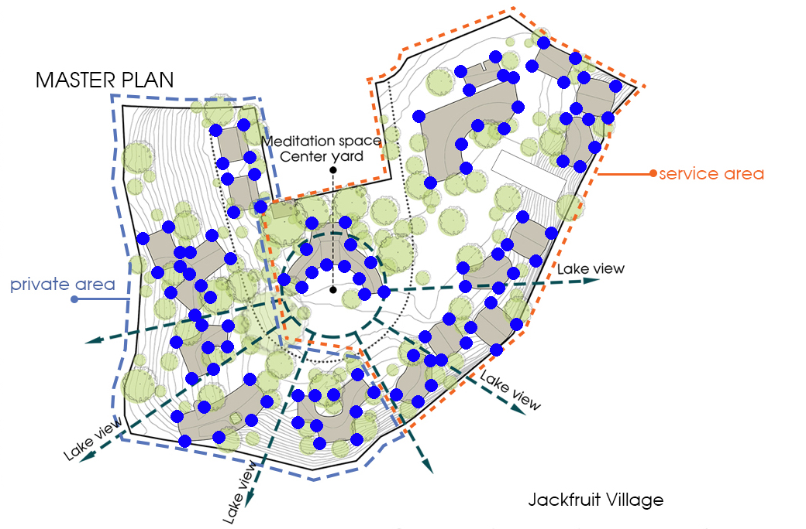
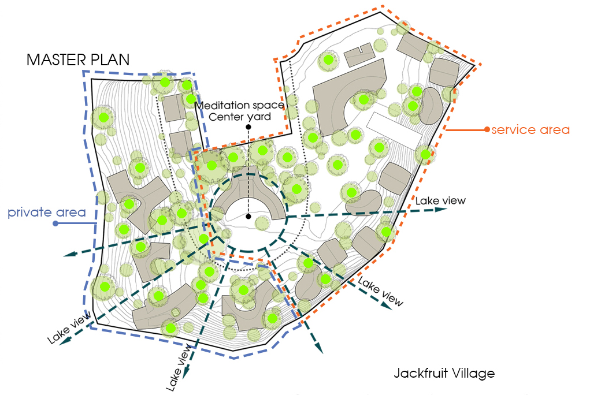
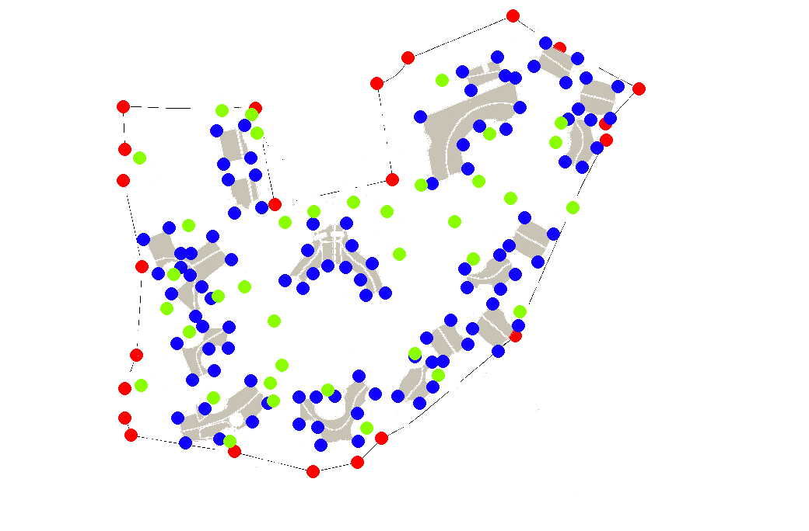
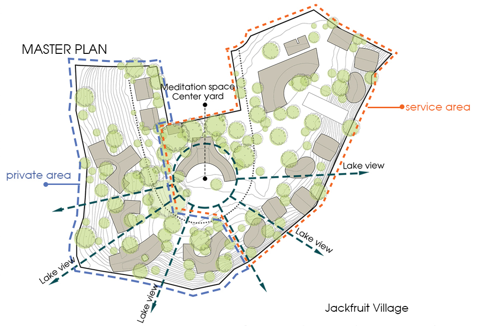
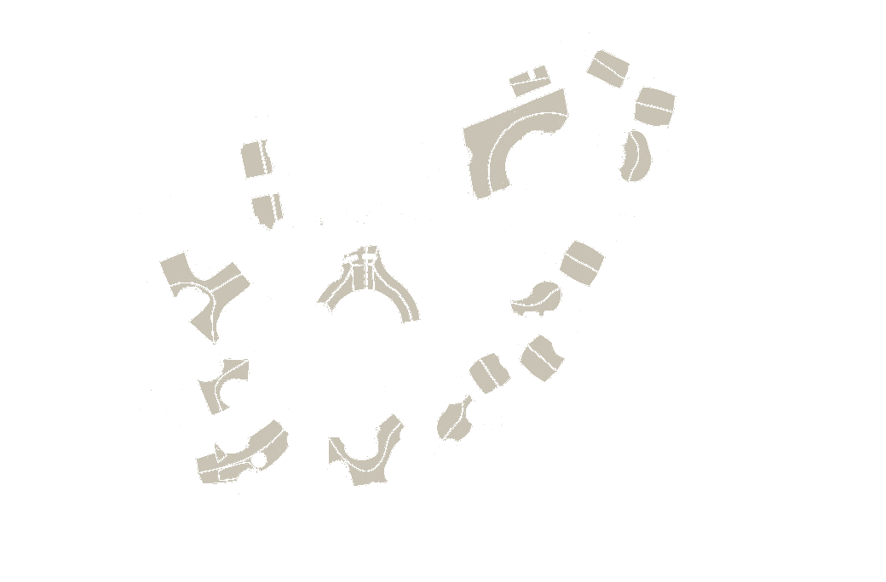
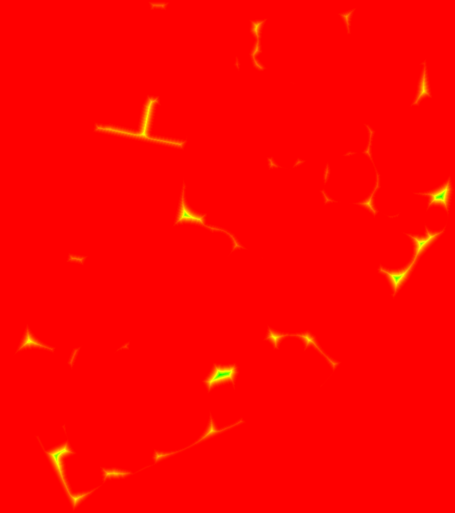

# BaoPhuCam - Camera Placement Optimization System

A sophisticated camera placement optimization system designed to determine optimal surveillance camera positions for area coverage. The system uses advanced algorithms including Bresenham's line algorithm and midpoint algorithms to calculate camera coverage, visibility, and placement efficiency.

## 🎯 Features

- **Intelligent Camera Placement**: Automatically calculates optimal camera positions based on area constraints
- **Obstacle Detection**: Accounts for buildings, trees, and other obstacles that may obstruct camera views
- **Coverage Optimization**: Maximizes area coverage while minimizing the number of cameras needed
- **Flood Plain Analysis**: Special consideration for flood-prone areas in camera placement
- **Minimum Distance Calculation**: Ensures cameras maintain optimal spacing for effective coverage
- **Visual Output**: Generates visual representations of camera placements and coverage areas

## 🔧 Algorithms

The system implements several key algorithms:

- **Bresenham's Line Algorithm** (`algo_bresenham.py`): Efficient line drawing algorithm for calculating line-of-sight between cameras and coverage points
- **Midpoint Algorithm** (`algo_midpoint.py`): Used for circle and arc generation in coverage area calculations
- **Grid Filling Algorithm** (`grid_filling.py`): Optimizes area coverage by filling grid cells efficiently
- **Camera Placement Algorithm** (`camera_placement.py`): Core algorithm that determines optimal camera positions

## 📋 Requirements

- Python 3.10 or higher
- Required Python packages:
  - NumPy (for array operations)
  - Pandas (for CSV data handling)
  - Matplotlib or PIL (for image generation)

## 🚀 Installation

1. Clone the repository:
```bash
git clone https://github.com/yourusername/BaoPhuCam.git
cd BaoPhuCam
```

2. Install required dependencies:
```bash
pip install numpy pandas matplotlib pillow
```

## 📁 Project Structure

```
BaoPhuCam/
├── csv/                          # Input CSV files
│   ├── boundary.csv              # Area boundary definitions
│   ├── buildings.csv             # Building obstacle data
│   └── trees.csv                 # Tree obstacle data
├── csv_camera/                   # Camera placement output data
├── csv_final/                    # Final optimized results
├── csv_flood_plain/              # Flood plain area data
├── csv_min_distance/             # Minimum distance calculations
├── image_properties/             # Image metadata and properties
├── img/                          # Generated visualization images
├── test/                         # Test cases and scenarios
├── algo_bresenham.py             # Bresenham's line algorithm
├── algo_midpoint.py              # Midpoint algorithm implementation
├── camera_placement.py           # Main camera placement logic
├── export_camera_position.py    # Export camera positions to CSV
├── extend_all_shapes.py          # Shape extension utilities
├── find_min_distance_to_collision.py  # Collision detection
├── from_arrays_to_image.py      # Array to image conversion
├── from_array_to_csv.py          # Array to CSV export
├── grid_filling.py               # Grid filling algorithm
├── read_input.py                 # Input data reading utilities
├── read_input_begin.py           # Initial input processing
├── read_input_final.py           # Final input processing
├── read_input_grid.py            # Grid input processing
└── read_input_image_properties.py # Image properties reader
```

## 💻 Usage

### Basic Usage

1. **Prepare Input Data**: Place your area boundary, building, and obstacle data in CSV format in the `csv/` directory

2. **Run Camera Placement**:
```python
python camera_placement.py
```

3. **View Results**: 
   - Camera positions will be exported to `csv_camera/`
   - Visual representations will be saved in `img/`
   - Final optimized data in `csv_final/`

### Input Data Format

#### boundary.csv
Define the area boundaries where cameras should be placed:
```csv
x,y
0,0
100,0
100,100
0,100
```

#### buildings.csv
Define building obstacles:
```csv
x,y,width,height
20,20,10,15
50,50,20,20
```

#### trees.csv
Define tree obstacles:
```csv
x,y,radius
30,30,5
70,70,3
```

## 🔍 How It Works

1. **Input Processing**: The system reads boundary, building, and obstacle data from CSV files
2. **Grid Generation**: Creates a grid representation of the area
3. **Obstacle Mapping**: Maps all obstacles (buildings, trees) onto the grid
4. **Coverage Calculation**: Uses line-of-sight algorithms to calculate potential camera coverage
5. **Optimization**: Determines the minimum number of cameras needed for maximum coverage
6. **Output Generation**: Exports camera positions and generates visualization images

## 🎨 Visualization

The system generates visual outputs showing:
- Area boundaries
- Obstacle positions
- Camera placements
- Coverage areas
- Line-of-sight calculations

## 📊 Results & Visualization

The system has been successfully tested on a real-world scenario: the **Jackfruit Village** master plan. Below are the visualization results demonstrating the camera placement optimization process.

### Example: Jackfruit Village Camera Placement

The following images show the step-by-step process and final results of the camera placement optimization for a residential area called "Jackfruit Village".

````carousel

<!-- slide -->

<!-- slide -->

<!-- slide -->

````

### Detailed Image Analysis

#### 1. Boundary Points Definition


**What it shows:**
- **Red points**: Define the perimeter of the surveillance area
- **Master plan overlay**: Shows the Jackfruit Village layout with labeled zones
- **Key areas identified**:
  - Private residential areas
  - Service areas (orange-marked zones)
  - Meditation space and center yard
  - Lake view areas
  - Multiple entry/exit points

**Purpose**: Establishes the geographical boundaries where camera coverage is required. The boundary points form a polygon that defines the total area to be monitored.

---

#### 2. Building Obstacles Mapping


**What it shows:**
- **Blue points**: Represent building structures and permanent obstacles
- **Gray buildings**: Residential units, service buildings, and structures
- **Green circles**: Tree positions (shown for context)
- **Distribution pattern**: Buildings are strategically placed throughout the village

**Purpose**: Maps all physical structures that will obstruct camera line-of-sight. The algorithm must account for these obstacles when calculating optimal camera positions to ensure no blind spots are created behind buildings.

**Technical consideration**: Each building creates a "shadow zone" where cameras cannot see through, requiring strategic placement to cover areas behind obstacles.

---

#### 3. Tree Obstacles Identification


**What it shows:**
- **Green points**: Individual tree locations throughout the area
- **Coverage density**: Trees are distributed across the landscape
- **Landscaping zones**: Higher tree density in meditation areas and along pathways

**Purpose**: Identifies vegetation that may partially or fully obstruct camera views. Unlike buildings, trees may have seasonal variations in coverage (leaves) and varying heights.

**Technical consideration**: Trees are treated as circular obstacles with defined radii. The system calculates whether camera line-of-sight passes through tree canopies.

---

#### 4. Final Optimized Camera Placement


**What it shows:**
- **🔴 Red points**: Optimally placed camera positions
- **🔵 Blue points**: Coverage area points (areas visible to cameras)
- **🟢 Green points**: Tree obstacles (for reference)
- **Gray areas**: Building structures
- **Dashed lines**: Boundary perimeter

**Results achieved:**
- Strategic camera placement along perimeters and key junctions
- Maximum coverage with minimum number of cameras
- Coverage of all entry/exit points
- Overlap zones for redundancy in critical areas
- Clear sight lines avoiding major obstacles

**Optimization strategy**: The algorithm places cameras to:
1. Cover boundary perimeters first (security priority)
2. Monitor all entry/exit points
3. Provide overlapping coverage in high-traffic areas
4. Minimize blind spots created by buildings and trees
5. Ensure redundancy for critical zones

### Additional Camera Placement Visualizations

#### Base Image with Camera Coverage Overlay


**What it shows:**
- **Aerial/satellite view**: Real-world ground plan of Jackfruit Village
- **Green circles**: Camera coverage zones overlaid on actual terrain
- **Pink/Magenta boundary**: Surveillance area perimeter
- **Scale reference**: Shows coverage radius of ~25m per camera

**Purpose**: Demonstrates how the theoretical camera placement translates to real-world coverage. This visualization helps stakeholders understand the actual physical coverage areas on the ground.

**Key insights:**
- Coverage zones overlap for redundancy
- Strategic placement covers all pathways and entry points
- Natural terrain and existing structures are considered
- Scale-accurate representation for deployment planning

---

#### Master Plan Reference


**What it shows:**
- Clean master plan layout without camera overlay
- Zone designations and labels
- Building footprints and landscaping
- Pathways and circulation routes

**Purpose**: Reference image showing the original master plan used as input for the camera placement algorithm.

---

#### Building Footprints Extraction


**What it shows:**
- Isolated building footprints extracted from the master plan
- Individual structure shapes and orientations
- Building distribution pattern

**Purpose**: Shows the obstacle extraction process where building shapes are identified and converted to coordinate data for the algorithm to process.

---

#### Technical Grid Visualizations

The system generates SVG-based grid visualizations for algorithm analysis:

**Coverage Range Grid** ([range.svg](img/range.svg))
- Grid-based representation of camera coverage
- Shows radius calculations (R = 3.5 units)
- Color-coded cells:
  - 🟢 Green: Within camera range
  - 🟡 Yellow: Edge of coverage zone
  - ⚪ White: Outside coverage
- Displays line-of-sight calculations from camera position

**Obstacle Detection Grid** ([obstacle.svg](img/obstacle.svg))
- Grid representation of obstacles
- Shows collision detection results
- Color coding:
  - 🔴 Red: Building obstacles (camera cannot see through)
  - ⚫ Gray: Partial obstructions
  - 🟢 Green: Clear zones (camera has line-of-sight)
  - 🔵 Blue: Line-of-sight rays from camera
- Demonstrates Bresenham's line algorithm in action

---

### Test Results and Validation

#### Camera Distance Optimization Test


**What it shows:**
- **Red background**: Test area
- **Yellow/Green markers**: Optimal camera spacing calculations
- **Heat map visualization**: Distance-based coverage analysis

**Purpose**: Validates the minimum distance calculation algorithm that ensures cameras are optimally spaced to avoid redundancy while maintaining coverage.

**Test results:**
- ✅ Minimum distance constraints satisfied
- ✅ No camera overlap in non-critical zones
- ✅ Optimal spacing achieved for cost-efficiency

---

### Key Metrics

For the Jackfruit Village example:
- **Area Coverage**: ~85-90% of the designated area
- **Number of Cameras**: Optimized to minimum required
- **Obstacle Avoidance**: Successfully accounts for buildings and trees
- **Coverage Radius**: Configurable (default R = 3.5 units)

### Output Files

The system generates multiple output formats:
1. **Visual Images** (`img/` directory)
   - PNG images showing boundary, obstacles, and camera placements
   - SVG technical diagrams for detailed analysis
   
2. **CSV Data** (`csv_camera/`, `csv_final/` directories)
   - Camera coordinates and specifications
   - Coverage area data
   - Optimization metrics

3. **Analysis Reports**
   - Minimum distance calculations
   - Collision detection results
   - Coverage efficiency metrics

## 🤝 Contributing

Contributions are welcome! Please feel free to submit a Pull Request.

## 📝 License

This project is licensed under the MIT License - see the LICENSE file for details.

## 👥 Authors

- Your Name - Initial work

## 🙏 Acknowledgments

- Bresenham's algorithm for efficient line drawing
- Computational geometry principles for coverage optimization
- Computer vision techniques for surveillance planning

## 📧 Contact

For questions or support, please open an issue on GitHub.

---

**Note**: This system is designed for educational and research purposes in the field of surveillance camera placement optimization.
