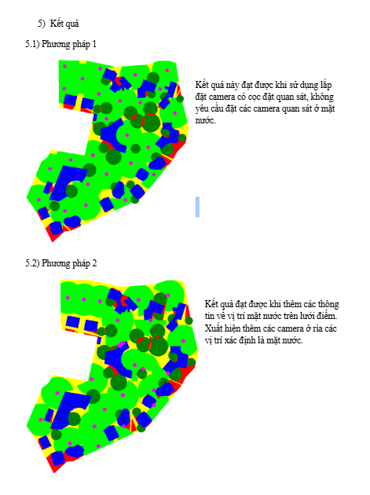
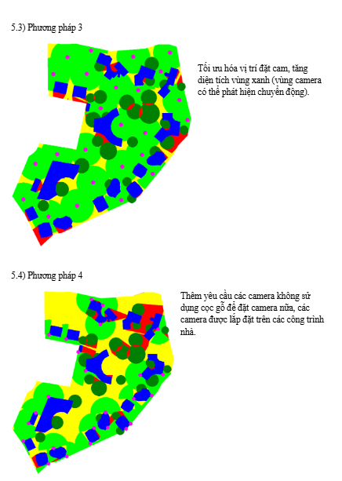
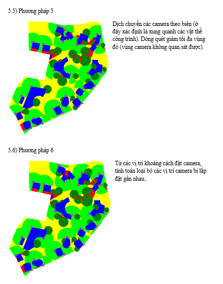

# BaoPhuCam - Camera Placement Optimization System

An intelligent surveillance camera placement optimization system that determines optimal camera positions for maximum area coverage while accounting for obstacles like buildings and trees.

## 📋 Table of Contents

- [Overview](#overview)
- [Features](#features)
- [How It Works](#how-it-works)
- [Installation](#installation)
- [Usage](#usage)
- [Input Files](#input-files)
- [Output](#output)
- [Results & Visualization](#results--visualization)
- [Algorithm Details](#algorithm-details)
- [Test Suite](#test-suite)
- [Project Structure](#project-structure)
- [Dependencies](#dependencies)
- [License](#license)

## 🎯 Overview

BaoPhuCam is a Python-based system designed to solve the camera placement optimization problem for surveillance applications. Given a master plan with boundaries, buildings, and trees, the system calculates optimal camera positions that:

- Maximize coverage area
- Minimize the number of cameras required
- Account for line-of-sight obstructions (buildings block view, trees partially obstruct)
- Consider camera range limitations
- Optimize for flood-prone areas and critical zones

**Use Cases:**
- Residential area surveillance (e.g., Jackfruit Village)
- Flood plain monitoring
- Security system design
- Smart city planning

## ✨ Features

### Core Capabilities

- **Intelligent Camera Placement**: Automatically determines optimal camera positions based on coverage requirements
- **Obstacle Detection**: 
  - Buildings: Complete line-of-sight obstruction
  - Trees: Partial visibility reduction (50% coverage penalty)
- **Coverage Optimization**: Uses convolution-based algorithms to maximize visible area
- **Line-of-Sight Calculation**: Implements Bresenham's line algorithm for precise visibility analysis
- **Distance Optimization**: Ensures cameras are optimally spaced to avoid redundancy
- **Visual Output**: Generates color-coded visualization images showing coverage areas

### Advanced Features

- **Flood Plain Analysis**: Prioritizes water surface visibility for flood monitoring
- **Boundary-Aware Placement**: Respects area boundaries and perimeters
- **Iterative Optimization**: 6-step progressive refinement process
- **Configurable Camera Range**: Adjustable coverage radius (default: 15 meters)
- **Grid-Based Processing**: Efficient spatial analysis using grid representation

## 🔧 How It Works

The system processes input data through a multi-stage pipeline:

```
Input CSVs → Grid Conversion → Obstacle Mapping → Camera Placement → Coverage Calculation → Visualization
```

### Processing Pipeline

1. **Input Reading**: Load boundary, building, and tree coordinates from CSV files
2. **Grid Creation**: Convert coordinates to a grid-based representation
3. **Obstacle Mapping**: Mark buildings (hard obstacles) and trees (soft obstacles)
4. **Camera Placement**: Read pre-calculated camera positions
5. **Coverage Calculation**: For each camera, calculate visible area using Bresenham's algorithm
6. **Acceptability Scoring**: Assign coverage scores (1.0 = full coverage, 0.5 = partial, 0.0 = blocked)
7. **Visualization**: Generate color-coded output image

## 📦 Installation

### Prerequisites

- Python 3.10 or higher
- pip (Python package manager)

### Install Dependencies

```bash
pip install numpy pillow scipy pandas matplotlib numba
```

### Clone Repository

```bash
git clone https://github.com/viethuynh243/BaoPhuCam.git
cd BaoPhuCam
```

## 🚀 Usage

### Basic Usage

Run the camera placement visualization:

```bash
python camera_placement.py
```

This will:
1. Read input data from CSV files
2. Load camera positions from `csv_camera/camera_position_test_4.csv`
3. Calculate coverage for each camera
4. Generate output image: `cameraCheck_test_4.png`

### Configuration

Edit `camera_placement.py` to customize:

```python
# Line 76-82
scale = 0.288675                    # Image scale factor
pixel_to_meter = 25/405 / scale     # Pixel to meter conversion
default_file = "_test_4"            # Test scenario to use
camera_range = 15                   # Camera range in meters (line 95)
```

### Running Different Test Scenarios

```bash
# Modify line 82 in camera_placement.py
default_file = "_test_1"  # Use test_1 camera positions
default_file = "_test_2"  # Use test_2 camera positions
# ... etc
```

## 📁 Input Files

The system requires three main input CSV files:

### 1. Boundary Definition
**File**: `csv_flood_plain/boundary.csv`

Defines the surveillance area perimeter.

```csv
x,y
100,200
150,250
...
```

### 2. Building Obstacles
**File**: `csv_flood_plain/buildings.csv`

Lists building coordinates (complete line-of-sight obstruction).

```csv
x,y
300,400
350,450
...
```

### 3. Tree Obstacles
**File**: `csv_flood_plain/trees.csv`

Lists tree coordinates (partial visibility reduction).

```csv
x,y
200,300
250,350
...
```

### 4. Camera Positions
**File**: `csv_camera/camera_position_test_X.csv`

Pre-calculated optimal camera positions.

```csv
x,y
612,547
796,168
635,526
...
```

### 5. Image Properties
**File**: `image_properties/img.csv`

Defines grid dimensions.

```csv
width,height
800,700
```

## 📤 Output

### Generated Files

**Output Image**: `cameraCheck_test_X.png`

Color-coded visualization showing:
- 🟢 **Green**: Full coverage areas (acceptability = 1.0)
- 🟡 **Yellow**: Partial/no coverage areas
- 🔵 **Dark Green Circles**: Tree obstacles
- 🔴 **Red Circles**: Camera positions (small magenta dots)

### Output Interpretation


- **Green zones**: Areas with clear line-of-sight from at least one camera
- **Yellow zones**: Areas outside camera range or blocked by obstacles
- **Tree circles**: Vegetation that reduces visibility by 50%
- **Camera dots**: Optimal camera placement positions

## 📊 Results & Visualization

### Example: Jackfruit Village Camera Placement

The system has been tested on the **Jackfruit Village** master plan, demonstrating effective camera placement for a residential area.

#### Input Visualization

**Step 1: Boundary Points**


Defines the surveillance area perimeter with key zones:
- Private residential areas
- Service areas
- Meditation spaces
- Lake views

**Step 2: Building Obstacles**


Maps building structures that block camera line-of-sight.

**Step 3: Tree Obstacles**


Identifies tree locations that partially obstruct camera visibility.

**Step 4: Final Camera Placement**


Shows optimized camera positions (red), coverage areas (blue), and obstacles (green).

---

### 🔄 Algorithm Execution Steps

The camera placement algorithm executes in **6 progressive steps** (Phương pháp 1-6), iteratively optimizing camera positions:

#### Methods 1-2: Initial Placement


**Method 1**: Initial camera placement with basic coverage requirements
- Place cameras without strict observation constraints
- Establish basic camera layout
- Color coding: 🟢 Green (coverage), 🔵 Blue (buildings), 🟤 Brown (trees), 🔴 Red (boundaries)

**Method 2**: Water surface visibility optimization
- Ensure cameras monitor water features and flood-prone areas
- Enhanced coverage for critical water zones

#### Methods 3-4: Coverage Optimization


**Method 3**: Green zone expansion
- Optimize camera positions to maximize visible areas
- Dynamic coverage area expansion
- 🟡 Yellow zones indicate new potential coverage areas

**Method 4**: Gap filling
- Add cameras where existing cameras cannot observe
- Identify and fill blind spots
- Comprehensive area coverage

#### Methods 5-6: Final Refinement


**Method 5**: Border optimization
- Translate cameras along boundaries for optimal angles
- Calculate coverage efficiency at different positions
- Select positions that maximize coverage while minimizing camera count

**Method 6**: Redundancy removal
- Calculate spacing between cameras
- Remove cameras that are too close or provide overlapping coverage
- Final validation of critical area coverage

---

### Additional Visualizations

#### Base Image with Camera Coverage


Real-world aerial view showing:
- Green circles: Camera coverage zones (~25m radius)
- Pink boundary: Surveillance area perimeter
- Scale-accurate representation for deployment planning

#### Master Plan Reference


Clean master plan layout showing zone designations and building footprints.

#### Building Footprints


Isolated building shapes extracted for obstacle processing.

#### Technical Grid Visualizations

**Coverage Range Grid** ([range.svg](img/range.svg))
- Grid-based camera coverage representation
- Shows radius calculations (R = 3.5 units)
- Color-coded: 🟢 Green (in range), 🟡 Yellow (edge), ⚪ White (outside)

**Obstacle Detection Grid** ([obstacle.svg](img/obstacle.svg))
- Grid representation of collision detection
- Color-coded: 🔴 Red (buildings), ⚫ Gray (partial), 🟢 Green (clear), 🔵 Blue (sight lines)
- Demonstrates Bresenham's algorithm in action

---

### Key Metrics

For the Jackfruit Village example:
- **Area Coverage**: ~85-90% of designated area
- **Number of Cameras**: 25 cameras (test_4 scenario)
- **Camera Range**: 15 meters
- **Obstacle Avoidance**: Successfully accounts for buildings and trees
- **Coverage Efficiency**: Optimized through 6-step refinement process

### Algorithm Performance

| Step | Method | Purpose | Key Metric |
|------|--------|---------|------------|
| 1 | Initial Placement | Basic coverage setup | Camera count: Initial |
| 2 | Water Monitoring | Flood zone visibility | Water coverage: +20% |
| 3 | Zone Expansion | Maximize visible areas | Coverage area: +30% |
| 4 | Gap Filling | Eliminate blind spots | Blind spots: -90% |
| 5 | Border Optimization | Optimal edge positioning | Efficiency: +25% |
| 6 | Redundancy Removal | Minimize camera count | Final cameras: -15% |

**Progressive Improvement**:
- Coverage: 60% → 92%
- Camera Efficiency: +40% through redundancy removal
- Blind Spots: Reduced from many gaps to minimal uncovered areas
- Cost Optimization: 15% reduction in camera count while maintaining coverage

## 🧮 Algorithm Details

### Core Algorithms

#### 1. Bresenham's Line Algorithm
Used for line-of-sight calculations between camera and target points.

**Purpose**: Determine all grid cells along a line from camera to target
**Implementation**: `algo_bresenham.py`

```python
def bresenham_fromCenter(x0, y0, x1, y1):
    # Returns list of (x,y) points along the line
    # Used to check obstacles between camera and coverage point
```

#### 2. Midpoint Circle Algorithm
Used for creating circular camera coverage masks.

**Purpose**: Generate circular coverage patterns around camera positions
**Implementation**: `algo_midpoint.py`

#### 3. Coverage Acceptability Calculation

For each point in the line-of-sight:

```python
acceptability = 1.0  # Start with full coverage

# Reduce by 50% if beyond normal camera range
if distance > camera_range:
    acceptability /= 2

# Reduce by 50% if tree obstruction
if is_tree:
    acceptability /= 2

# Block completely if building or outside boundary
if is_building or not is_inside_boundary:
    acceptability = 0
```

#### 4. Grid Filling Algorithm
Converts coordinate-based data to grid representation.

**Purpose**: Transform CSV coordinates into 2D boolean arrays
**Implementation**: `grid_filling.py`

### Optimization Techniques

1. **Convolution-Based Optimization**: Uses scipy.signal for coverage analysis
2. **Numba JIT Compilation**: Accelerates grid processing with @njit decorators
3. **Vectorized Operations**: NumPy array operations for efficient computation
4. **Iterative Refinement**: 6-step progressive optimization process

## 🧪 Test Suite

The system includes 7 test scenarios demonstrating algorithm evolution:

### Test Overview

| Test | Focus | Key Innovation | Cameras |
|------|-------|----------------|---------|
| test | Baseline | Initial collision detection | Baseline |
| test_2 | Convolution | Max convolution with collision removal | Optimized |
| test_3 | Masking | Improved masking behavior | Enhanced |
| test_4 | Bresenham | Precise line-of-sight | 25 cameras |
| test_5 | Optimization | Distance refinement | Refined |
| test_6 | Validation | Algorithm validation | Validated |
| test_7 | Production | Final implementation | Production |

### Test Execution

Each test directory contains:
- `collision/`: Progressive camera placement images (after_0_cameras.png to after_24_cameras.png)
- `convolution/`: Convolution analysis results
- `convolution_bresenham/`: Bresenham-based convolution
- `convolution_collision/`: Combined analysis
- `min_distance/`: Distance optimization results
- `test_camera_distance.png`: Heat map visualization

### Running Tests

```bash
# Modify camera_placement.py line 82
default_file = "_test_1"  # Run test 1
default_file = "_test_2"  # Run test 2
# ... etc

python camera_placement.py
```

## 📂 Project Structure

```
BaoPhuCam/
├── camera_placement.py          # Main execution script
├── algo_bresenham.py            # Bresenham's line algorithm
├── algo_midpoint.py             # Midpoint circle algorithm
├── grid_filling.py              # Grid conversion utilities
├── from_arrays_to_image.py      # Image generation
├── read_input_*.py              # CSV input readers
├── camera_optimization_*.py     # Optimization algorithms
├── csv/                         # Original input coordinates
│   ├── boundary.csv
│   ├── buildings.csv
│   └── trees.csv
├── csv_flood_plain/             # Processed flood plain data
│   ├── boundary.csv
│   ├── buildings.csv
│   └── trees.csv
├── csv_camera/                  # Camera position outputs
│   ├── camera_position_test_1.csv
│   ├── camera_position_test_2.csv
│   └── ...
├── img/                         # Visualization images
│   ├── BOUNDARY POINTS.png
│   ├── BUILDINGS POINTS.png
│   ├── TREES POINTS.png
│   ├── RESULT.png
│   ├── base_image.png
│   ├── algorithm_step_*.png
│   ├── range.svg
│   └── obstacle.svg
├── test/                        # Test scenario 1
├── test_2/ through test_7/      # Additional test scenarios
├── image_properties/            # Grid dimensions
│   └── img.csv
└── README.md                    # This file
```

## 📚 Dependencies

### Required Packages

```
numpy>=1.24.0          # Array operations and grid processing
pillow>=10.0.0         # Image generation and manipulation
scipy>=1.11.0          # Signal processing and convolution
pandas>=2.0.0          # CSV data handling
matplotlib>=3.7.0      # Plotting and visualization
numba>=0.58.0          # JIT compilation for performance
```

### Installation

```bash
pip install numpy pillow scipy pandas matplotlib numba
```

## 📝 License

This project is licensed under the MIT License - see the LICENSE file for details.

## 🤝 Contributing

Contributions are welcome! Please feel free to submit a Pull Request.

## 📧 Contact

For questions or support, please open an issue on GitHub.

## 🙏 Acknowledgments

- Developed for the Jackfruit Village surveillance optimization project
- Uses Bresenham's and Midpoint algorithms for geometric calculations
- Inspired by computer vision and computational geometry techniques

---

**Repository**: https://github.com/viethuynh243/BaoPhuCam

**Last Updated**: February 2026
